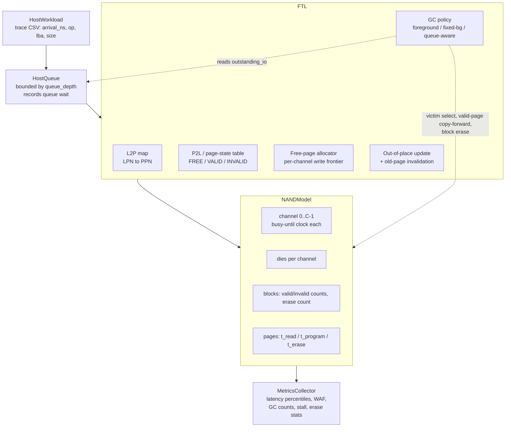
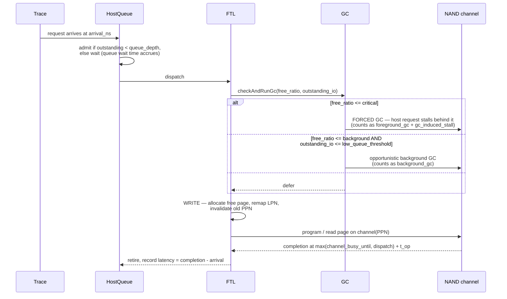
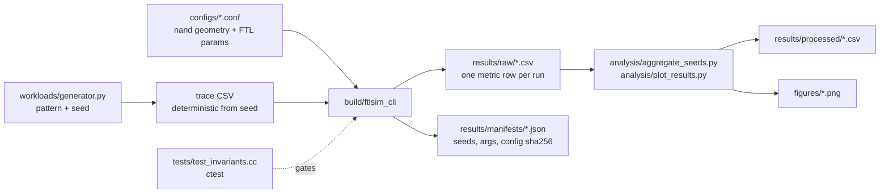

# Architecture

## Data path being modeled

The one link that makes this project what it is: **`GC` reads `outstanding_io` from
`HostQueue`**. Foreground and fixed-background policies do not — they decide purely on
free-page ratio. The queue-aware policy adds queue occupancy as a second input, which is
the entire hypothesis under test.

## Request lifecycle

## Experiment workflow

## Component responsibilities

| Component | File | Holds |
|---|---|---|
| `NandGeometry` | `include/ftlsim/Config.h` | page size, pages/block, blocks/die, dies/channel, channels, t_read/t_program/t_erase |
| `FtlParams` | `include/ftlsim/Config.h` | OP %, critical/background free ratios, low-queue threshold, GC policy, queue depth |
| `Ftl` | `src/Ftl.cc` | L2P/P2L, page state, per-channel free counts, write frontier, GC, event loop |
| `RunMetrics` | `include/ftlsim/Metrics.h` | latency samples → p50/p95/p99, WAF, GC counters, erase stats |
| `Trace` | `include/ftlsim/Trace.h` | CSV parse, LBA→LPN, size→page count |

`Ftl::run()` is a single-pass discrete-event loop over the arrival-ordered trace; there
is no separate event heap. Per-channel `busy_until` clocks provide the parallelism, and
each request's completion is `max(channel_busy_until, admit_time) + service_time`. This
is a deliberate simplification — see `docs/limitations.md` for what it costs.

## Address mapping

Page-level (not block- or hybrid-level) mapping:

- `l2p_[lpn] -> ppn` (`-1` = unmapped)
- `p2l_[ppn] -> lpn` (`-1` = not holding valid data)
- `page_state_[ppn] ∈ {FREE, VALID, INVALID}`

Every write allocates a fresh FREE page from the current channel's write frontier,
points `l2p_` at it, and marks the previous PPN INVALID. Blocks track `valid_count` /
`invalid_count` so GC victim selection is O(blocks) greedy-min-valid without rescanning
pages. `Ftl::validateInvariants()` re-derives all of these counts from
`page_state_` and fails if any bookkeeping has drifted — it is called from the test
suite after every scenario.
